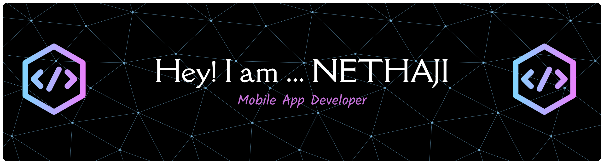

<h1 align="center">Hi 👋, I'm NETHAJI</h1>
<h3 align="center">A passionate mobile app developer from India</h3>

  

- 🔭 I’m currently working on **Resume Builder**

- 🌱 I’m currently learning **Flutter**

- 📫 How to reach me **nethajip240@gmail.com**

- ⚡ Fun fact **a thousand mile journey begins with the first step**

<h3 align="left">Connect with me:</h3>

<h3 align="left">Languages and Tools:</h3>

              

&nbsp;

